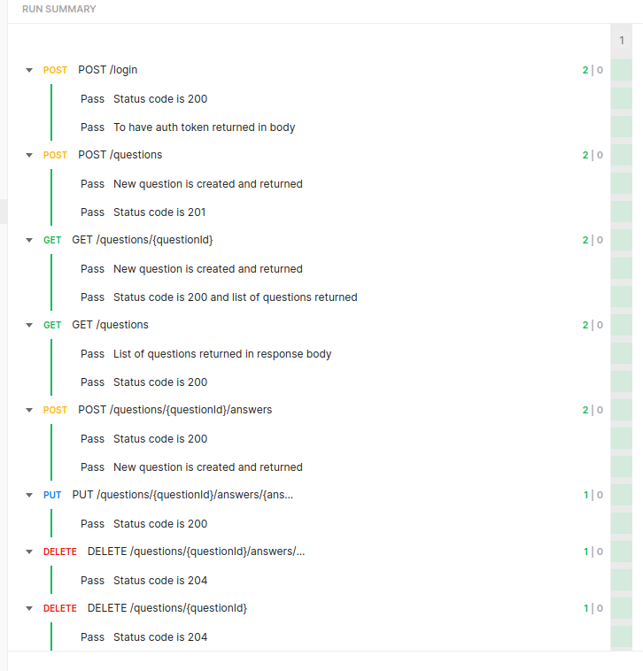

# Subsbase QnA Assessment

## Endpoints

- [x] POST ​/login -> The login endpoint
- [x] GET ​/questions -> Get all questions and their answers
- [x] POST ​/questions -> Add a new question
- [x] GET​ /questions​/{questionId} -> Get a question
- [x] POST ​/questions​/{questionId}​/answers -> Add an answer to question
- [x] DELETE ​/questions​/{questionId}​/answers​/{answerId} -> Delete an answer
- [x] PUT ​/questions​/{questionId}​/answers​/{answerId}​/votes -> Up/Down/Un-Vote an answer

Optional:  
- [x] DELETE ​/questions​/{questionId} -> Delete a question


## Testing:
- [ ] Unit tests
- [x] Functional tests (Postman collection)  
*Please set `port` global environment variable in Postman*


## Authentication
To authenticate:  
**POST /login**
```json
{
    "username": "alexander_fleming",
    "password: "penicillin"
}
```
Then the returned auth token to be sent in Authorization header in all other endpoints as following, for example:  
Authorization: Bearer ABCDE...

## Expected Deliverables

- [x] Entire code should be delivered in a git repo.
- [x] The final git repo could be either pushed to any free git hosting service (providing us with a link).
- [x] There is no restriction on how many commits/branches are included on the repo. However, we will highly appreciate the proper use of source control with relevant commits and commit messages.
- [x] Please deliver the backend with at least 5 users set up and provide the list of users and passwords in a text file in the same delivery folder.
```
Please check users.md file
```
- [ ] Dockerfile should be included in repo if you go for that optional requirement
- [x] Postman collection should be included in repo if you go for that optional requirement
- [x] Please record the time it took you to complete the task  
```
24 Hours
```

---

## Requirements
- .NET 6 SDK
    - For Ubuntu 22.04:
    ```bash
    sudo apt-get install -y dotnet6
    ```

## API (inside /qna directory)
Build:
```bash
dotnet build
```

Run migration:
```bash
dotnet tool install --global dotnet-ef
dotnet-ef database update
```

Run api:
```bash
dotnet run
```

For API documentation, check generated Swagger API docs:
```
https://localhost:7025/swagger/index.html
```

--- 

Run api and watch for changes:
```bash
dotnet watch
```

Add migration:
```bash
dotnet-ef migrations add MigrationName
```

Remove migration:
```bash
dotnet-ef migrations remove
```
